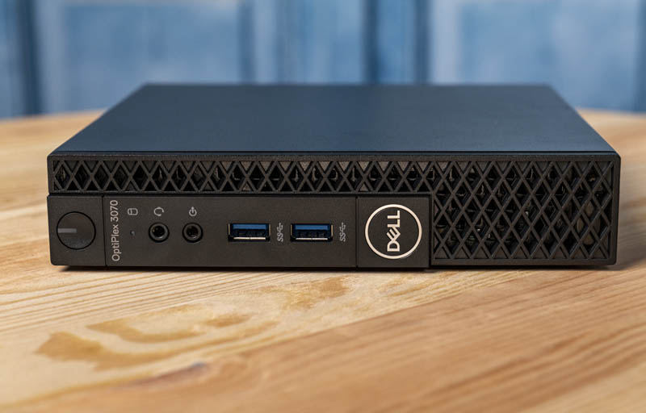
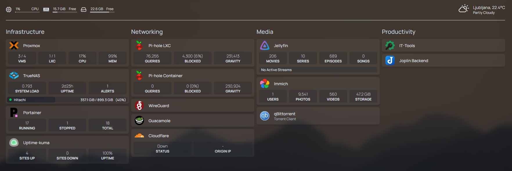
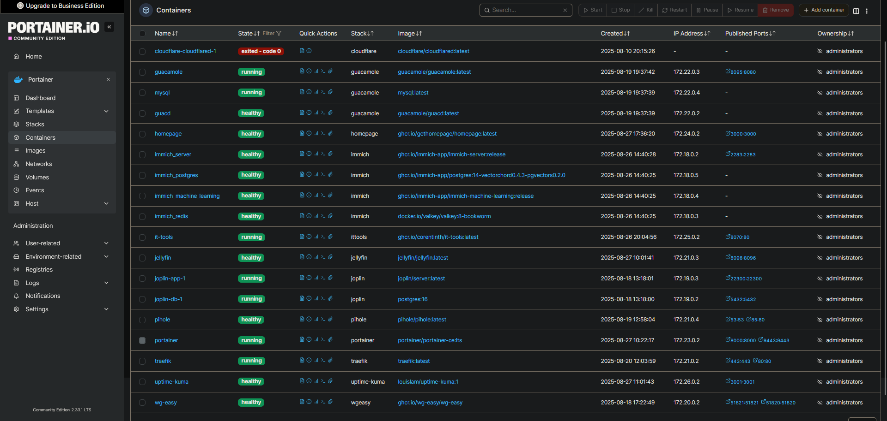

# 🖥️ Homelab

Welcome to my homelab!  
This setup is where I experiment with virtualization, networking, and self-hosted services.  
It helps me learn about Linux system administration, containerization, and IT infrastructure in practice.

---

## 📦 Hardware

- **Server:** Dell OptiPlex 3070 Micro
- **CPU:** Intel i5-9500T (6 cores / 6 threads)
- **RAM:** 32 GB DDR4
- **Storage:**
  - 1 TB Crucial P2 NVMe SSD (system + VMs/containers)
  - 1 TB SATA HDD (TrueNAS passthrough, media storage)

---

## ⚙️ Virtualization Platform

- **Proxmox VE** – hypervisor managing multiple VMs
- **VMs:**
  - Debian 13 (Docker host, Portainer, Jellyfin, Immich, Guacamole, WireGuard VPN)
  - TrueNAS (storage, SMB share for Media)
  - Arch Linux (testing + LinuxHelper project)

---

## 🐳 Containers & Services

- **Jellyfin** – media streaming from my `Media` SMB share
- **Immich** – photo & video management
- **Guacamole** – remote access to VMs
- **WireGuard** – secure remote VPN
- **DuckDNS** – dynamic DNS
- **Portainer** – container management dashboard
- (More experiments coming soon!)

---

## 🌐 Networking & Storage

- **NAS:** TrueNAS VM with HDD passthrough
- **Shares:** SMB for movies & media
- **VPN:** WireGuard for remote access
- **Backups:** Manual and scheduled snapshots via Proxmox

---

## 📸 Photos & Screenshots

### Physical Setup

### Proxmox / Docker

---

## 🎯 Goals & Learning

- Improve skills in Linux system administration  
- Learn Docker & container orchestration  
- Experiment with virtualization & storage solutions  
- Explore automation and monitoring tools in the future  

---

## 🔗 Related Projects

- [PCPartPicker Build](https://pcpartpicker.com/b/znmkcf) – My custom SFF PC build
